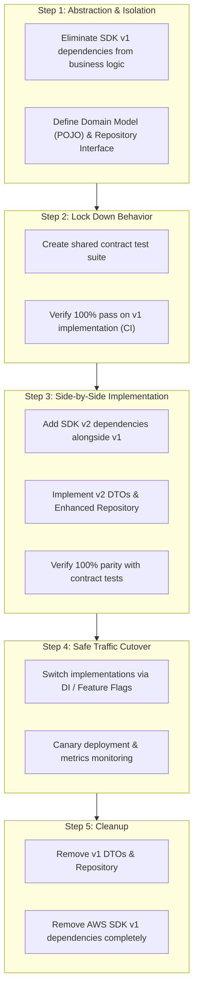

# DynamoDB v1 to v2 Migration Sample Project

**English** | [日本語](README_ja.md)

[](https://github.com/green-tea-stalk/dynamodb-migration-sample/actions/workflows/ci.yml)
[](https://docs.github.com/en/code-security/dependabot)
[](https://openjdk.org/projects/jdk/25/)
[](https://gradle.org)
[](https://projectlombok.org/)
[](https://aws.amazon.com/sdk-for-java/)
[](https://aws.amazon.com/sdk-for-java/)
[](https://testcontainers.com/)
[](https://github.com/diffplug/spotless)

This repository is a comprehensive reference sample demonstrating how to safely and incrementally migrate from **AWS SDK for Java v1 (`DynamoDBMapper`)** to **AWS SDK for Java v2 (`DynamoDbEnhancedClient`)**.

It covers common real-world DynamoDB operations (CRUD, optimistic locking, batch operations, transactions, PK/SK queries, GSI queries, filtered scans, and pagination) and uses a shared **Contract Test** suite to automatically verify **100% behavioral parity between v1 and v2 implementations**.

> 📖 **Comprehensive Guide on Architecture, Coding Standards & Gotchas**:
> For system design principles, coding conventions, and migration gotchas, see [AGENTS.md](AGENTS.md).

---

## 📑 Table of Contents

- [🎯 Migration Architecture Principles](#-migration-architecture-principles)
- [🗺️ Safe Incremental Migration Roadmap](#️-safe-incremental-migration-roadmap)
  - [Step 1: Domain Isolation & Repository Abstraction (Preparation)](#step-1-domain-isolation--repository-abstraction-preparation)
  - [Step 2: Shared Contract Test Creation](#step-2-shared-contract-test-creation)
  - [Step 3: SDK v2 Parallel Implementation & Parity Verification](#step-3-sdk-v2-parallel-implementation--parity-verification)
  - [Step 4: Safe Traffic Cutover (DI / Feature Flag / Canary)](#step-4-safe-traffic-cutover-di--feature-flag--canary)
  - [Step 5: Full Decommissioning of SDK v1 (Cleanup)](#step-5-full-decommissioning-of-sdk-v1-cleanup)
  - [⚖️ Migration Strategy Comparison & Trade-offs](#️-migration-strategy-comparison--trade-offs)
- [📊 v1 vs v2 Side-by-Side Comparison](#-v1-vs-v2-side-by-side-comparison)
  - [1. Dependencies (Gradle Version Catalog)](#1-dependencies-gradle-version-catalog)
  - [2. Client Initialization](#2-client-initialization)
  - [3. Entity / DTO Mapping (Annotation Comparison)](#3-entity--dto-mapping-annotation-comparison)
  - [4. Operation Implementations](#4-operation-implementations)
- [⚠️ Key Migration Gotchas](#️-key-migration-gotchas)
- [📁 Project Structure](#-project-structure)
- [🚀 Build & Test Instructions](#-build--test-instructions)

---

## 🎯 Migration Architecture Principles

To ensure zero-downtime and risk-free migration in production systems, this project follows three strict architectural principles (see [AGENTS.md](AGENTS.md#2-architecture-principles-for-safe-migration)):

```
                  ┌──────────────────────────────┐
                  │    Domain Model (Order)      │  ← Pure POJO / Record (SDK-Independent)
                  └──────────────▲───────────────┘
                                 │
                  ┌──────────────┴───────────────┐
                  │ <<Interface>> OrderRepository│  ← Unified Repository Interface
                  └──────────────▲───────────────┘
                                 │
              ┌───────────────────┴───────────────────┐
              │                                       │
┌────────────────────────────┐       ┌────────────────────────────┐
│ V1DynamoDbOrderRepository  │       │ V2DynamoDbEnhancedOrder    │
│  (AWS SDK v1 DynamoDBMapper│       │  Repository                │
│   + OrderItemV1 DTO)       │       │  (AWS SDK v2 Enhanced      │
│                            │       │   + OrderItemV2 DTO)       │
└────────────────────────────┘       └────────────────────────────┘
```

1. **Domain Independence**:
   - Classes in `com.example.dynamodb.domain` (`Order`, `OrderKey`, `OrderLineItem`, `OrderStatus`) are pure POJOs / Records without any AWS SDK annotations or types.
2. **Repository Encapsulation**:
   - The business layer interacts exclusively through the `OrderRepository` interface. SDK-specific types (`DynamoDBMapper`, `DynamoDbEnhancedClient`, `AttributeValue`, etc.) are never exposed.
3. **Contract Testing for Parity**:
   - A single shared test suite (`OrderRepositoryContractTest`) is executed against both v1 and v2 implementations using Testcontainers (`amazon/dynamodb-local`) (12 scenarios, 24 total test cases).

---

## 🗺️ Safe Incremental Migration Roadmap

Migrating all DynamoDB operations in a single large release ("Big-Bang" migration) poses severe risks due to subtle behavioral differences between SDKs.
We recommend a **5-step Side-by-Side migration process**:



### Step 1: Domain Isolation & Repository Abstraction (Preparation)
- **Actions**:
  - Encapsulate all AWS SDK v1 classes (`DynamoDBMapper`, `AttributeValue`, `@DynamoDBTable`) within the data access layer.
  - Define pure POJO domain models ([Order.java](src/main/java/com/example/dynamodb/domain/Order.java)) and a unified repository interface ([OrderRepository.java](src/main/java/com/example/dynamodb/repository/OrderRepository.java)).
  - Consolidate existing v1 logic into [V1DynamoDbOrderRepository.java](src/main/java/com/example/dynamodb/repository/v1/V1DynamoDbOrderRepository.java).
- **Outcome**: The entire application becomes SDK-agnostic, localizing all future migration changes to repository packages.

### Step 2: Shared Contract Test Creation
- **Actions**:
  - Create a contract test suite ([OrderRepositoryContractTest.java](src/test/java/com/example/dynamodb/OrderRepositoryContractTest.java)) against `OrderRepository`.
  - Run tests on DynamoDB Local via Testcontainers ([V1OrderRepositoryTest.java](src/test/java/com/example/dynamodb/V1OrderRepositoryTest.java)) covering all 12 core scenarios (CRUD, optimistic locking, batch, transactions, queries, scans, pagination).
- **Outcome**: Existing production behavior is permanently captured in executable test specifications.

### Step 3: SDK v2 Parallel Implementation & Parity Verification
- **Actions**:
  - Add AWS SDK v2 dependencies to `build.gradle.kts` without removing v1.
  - Create the `com.example.dynamodb.repository.v2` package with v2 DTOs ([OrderItemV2.java](src/main/java/com/example/dynamodb/repository/v2/OrderItemV2.java)) and the repository implementation ([V2DynamoDbEnhancedOrderRepository.java](src/main/java/com/example/dynamodb/repository/v2/V2DynamoDbEnhancedOrderRepository.java)).
  - Run [V2OrderRepositoryTest.java](src/test/java/com/example/dynamodb/V2OrderRepositoryTest.java) against the contract test suite, resolving any [Gotchas](#️-key-migration-gotchas) until all 12 tests pass.
- **Outcome**: The v2 implementation achieves 100% verified compatibility in CI without altering running v1 code.

### Step 4: Safe Traffic Cutover (DI / Feature Flag / Canary)
- **Actions**:
  - Use dependency injection (e.g., Spring `@Primary` or profile-based beans) or feature flags to switch the active repository from v1 to v2.
  - Perform staging load tests followed by canary rollouts (e.g., 1% → 10% → 50% → 100%) in production, observing latency, error rates, and CPU/memory metrics.
  - Instantly roll back to v1 via configuration toggle if anomalies occur.
- **Outcome**: Seamless, zero-downtime production cutover.

### Step 5: Full Decommissioning of SDK v1 (Cleanup)
- **Actions**:
  - Once v2 is verified stable in production, remove `com.example.dynamodb.repository.v1` (`OrderItemV1`, `V1DynamoDbOrderRepository`, TypeConverters) and `V1OrderRepositoryTest`.
  - Remove AWS SDK v1 dependencies from `build.gradle.kts` and `gradle/libs.versions.toml`.
- **Outcome**: Eliminates dead code and redundant dependencies, leaving a clean SDK v2 architecture.

---

### ⚖️ Migration Strategy Comparison & Trade-offs

| Dimension | Incremental (Side-by-Side) <br> **[Recommended / Adopted]** | Big-Bang (All-at-Once) |
| :--- | :--- | :--- |
| **Migration Risk** | 🟢 **Extremely Low** (Parity verified in CI + instant rollback) | 🔴 **High** (Unexpected behavioral gaps in production) |
| **Downtime** | 🟢 **Zero** (Seamless live transition) | 🟡 May require maintenance window |
| **Regression Detection** | 🟢 **100% caught in CI before deployment** | 🔴 Discovered late during manual QA or in production |
| **Implementation Effort** | 🟡 Temporary co-existence of v1/v2 code | 🟢 Quick code replacement |
| **Binary Size** | 🟡 Both SDKs packaged during migration phase | 🟢 Single SDK packaged at all times |

---

## 📊 v1 vs v2 Side-by-Side Comparison

### 1. Dependencies (Gradle Version Catalog)

Dependencies are centrally managed using Gradle **Version Catalogs** (`gradle/libs.versions.toml`). AWS SDK v2 is modularized and uses a Bill of Materials (BOM).

```toml
# gradle/libs.versions.toml
[versions]
aws-sdk-v1 = "1.12.797"
aws-sdk-v2 = "2.54.2"
lombok = "1.18.46"

[libraries]
# AWS SDK v1
aws-sdk-v1-dynamodb = { module = "com.amazonaws:aws-java-sdk-dynamodb", version.ref = "aws-sdk-v1" }

# AWS SDK v2
aws-sdk-v2-bom = { module = "software.amazon.awssdk:bom", version.ref = "aws-sdk-v2" }
aws-sdk-v2-dynamodb = { module = "software.amazon.awssdk:dynamodb" }
aws-sdk-v2-dynamodb-enhanced = { module = "software.amazon.awssdk:dynamodb-enhanced" }
aws-sdk-v2-url-connection-client = { module = "software.amazon.awssdk:url-connection-client" }
```

```kotlin
// build.gradle.kts
dependencies {
    // Lombok
    compileOnly(libs.lombok)
    annotationProcessor(libs.lombok)

    // AWS SDK v1
    implementation(libs.aws.sdk.v1.dynamodb)

    // AWS SDK v2
    implementation(platform(libs.aws.sdk.v2.bom))
    implementation(libs.aws.sdk.v2.dynamodb)
    implementation(libs.aws.sdk.v2.dynamodb.enhanced)
    implementation(libs.aws.sdk.v2.url.connection.client) // Lightweight HTTP client
    implementation(libs.jackson.databind)
}
```

### 2. Client Initialization

| Feature | SDK v1 | SDK v2 |
| :--- | :--- | :--- |
| **Base Client** | `AmazonDynamoDBClientBuilder.standard()...build()` | `DynamoDbClient.builder()...build()` |
| **High-Level Mapper** | `new DynamoDBMapper(amazonDynamoDB)` | `DynamoDbEnhancedClient.builder().dynamoDbClient(client).build()` |
| **HTTP Client** | Apache HTTP Client (Fixed) | Pluggable (`url-connection-client`, `apache-client`, `netty-nio-client`) |
| **Endpoint Config** | `builder.withEndpointConfiguration(new AwsClientBuilder.EndpointConfiguration(endpoint, region))` | `builder.endpointOverride(URI.create(endpoint))` |

### 3. Entity / DTO Mapping (Annotation Comparison)

| Feature | SDK v1 (`OrderItemV1`) | SDK v2 (`OrderItemV2`) |
| :--- | :--- | :--- |
| **Class Declaration** | `@DynamoDBTable(tableName = "orders")` | `@DynamoDbBean` (Table name bound programmatically) |
| **Partition Key (PK)** | `@DynamoDBHashKey(attributeName = "customerId")` | `@DynamoDbPartitionKey`<br>`@DynamoDbAttribute("customerId")` |
| **Sort Key (SK)** | `@DynamoDBRangeKey(attributeName = "orderId")` | `@DynamoDbSortKey`<br>`@DynamoDbAttribute("orderId")` |
| **GSI PK** | `@DynamoDBIndexHashKey(globalSecondaryIndexName = "...", attributeName = "...")` | `@DynamoDbSecondaryPartitionKey(indexNames = "...")` |
| **GSI SK** | `@DynamoDBIndexRangeKey(globalSecondaryIndexName = "...", attributeName = "...")` | `@DynamoDbSecondarySortKey(indexNames = "...")` |
| **Optimistic Lock** | `@DynamoDBVersionAttribute(attributeName = "version")` | `@DynamoDbVersionAttribute`<br>`@DynamoDbAttribute("version")` |
| **Date/Time (`Instant`)** | `@DynamoDBTypeConverted(converter = InstantTypeConverter.class)` (Custom) | Auto-converted to ISO-8601 string natively |
| **Enum** | `@DynamoDBTypeConvertedEnum` | Auto-converted to enum `name()` string natively |
| **Nested Objects** | `@DynamoDBDocument` | `@DynamoDbBean` |

### 4. Operation Implementations

#### (1) Table Reference
- **v1**: Statically declared on DTO via `@DynamoDBTable(tableName = "orders")`.
- **v2**: Dynamically bound via `enhancedClient.table("orders", TableSchema.fromBean(OrderItemV2.class))`.

#### (2) Primary Key Lookup (GetItem / findById)
- **v1**:
  ```java
  OrderItemV1 item = mapper.load(OrderItemV1.class, customerId, orderId);
  ```
- **v2**:
  ```java
  Key key = Key.builder().partitionValue(customerId).sortValue(orderId).build();
  OrderItemV2 item = table.getItem(r -> r.key(key).consistentRead(true));
  ```

#### (3) Optimistic Locking Update (updateStatus)
- **v1**:
  ```java
  item.setStatus(newStatus);
  item.setVersion(expectedVersion); // Set expected version
  mapper.save(item); // Throws ConditionalCheckFailedException on conflict
  ```
- **v2**:
  ```java
  item.setStatus(newStatus);
  item.setVersion(expectedVersion); // Set expected version
  table.putItem(item); // Validates version & auto-increments in DynamoDB
  ```

#### (4) Batch Operations (batchSave / batchFindByIds)
- **v1 (Batch Save / Batch Load)**:
  ```java
  // Batch Save
  mapper.batchSave(items);

  // Batch Load
  Map<String, List<Object>> results = mapper.batchLoad(itemsToLoad);
  ```
- **v2 (BatchWriteItem / BatchGetItem)**:
  ```java
  // Batch Write
  WriteBatch<OrderItemV2> writeBatch = WriteBatch.builder(OrderItemV2.class)
          .mappedTableResource(table)
          .addPutItem(item1)
          .addPutItem(item2)
          .build();
  enhancedClient.batchWriteItem(r -> r.writeBatches(writeBatch));

  // Batch Get
  ReadBatch readBatch = ReadBatch.builder(OrderItemV2.class)
          .mappedTableResource(table)
          .addGetItem(key1)
          .addGetItem(key2)
          .build();
  enhancedClient.batchGetItem(r -> r.readBatches(readBatch)).resultsForTable(table);
  ```

#### (5) Transaction Operations (executeInTransaction)
- **v1 (TransactionWriteRequest)**:
  ```java
  TransactionWriteRequest txRequest = new TransactionWriteRequest();
  txRequest.addPut(item1);
  txRequest.addPut(item2);
  mapper.transactionWrite(txRequest);
  ```
- **v2 (TransactWriteItemsEnhancedRequest)**:
  ```java
  TransactWriteItemsEnhancedRequest txRequest = TransactWriteItemsEnhancedRequest.builder()
          .addPutItem(table, item1)
          .addPutItem(table, item2)
          .build();
  enhancedClient.transactWriteItems(txRequest);
  ```

#### (6) GSI Query (findByStatus)
- **v1**:
  ```java
  OrderItemV1 hashKeyValues = new OrderItemV1();
  hashKeyValues.setStatus(status);
  DynamoDBQueryExpression<OrderItemV1> expr = new DynamoDBQueryExpression<OrderItemV1>()
          .withIndexName("status-orderDate-index")
          .withHashKeyValues(hashKeyValues)
          .withConsistentRead(false);
  List<OrderItemV1> results = mapper.query(OrderItemV1.class, expr);
  ```
- **v2**:
  ```java
  DynamoDbIndex<OrderItemV2> index = table.index("status-orderDate-index");
  QueryConditional conditional = QueryConditional.keyEqualTo(
          Key.builder().partitionValue(status.name()).build()
  );
  List<OrderItemV2> results = new ArrayList<>();
  index.query(r -> r.queryConditional(conditional))
       .forEach(page -> results.addAll(page.items()));
  ```

#### (7) Paged Scan (scanOrdersPaged)
- **v1**: Retrieve `page.getLastEvaluatedKey()` (`Map<String, com.amazonaws.services.dynamodbv2.model.AttributeValue>`) from `mapper.scanPage(OrderItemV1.class, scanExpression)`.
- **v2**: Retrieve `page.lastEvaluatedKey()` (`Map<String, software.amazon.awssdk.services.dynamodb.model.AttributeValue>`) from `table.scan(request).iterator().next()`.

---

## ⚠️ Key Migration Gotchas

Common pitfalls when migrating from v1 to v2 (detailed in [AGENTS.md#6-dynamodb-migration-gotchas--best-practices](AGENTS.md#6-dynamodb-migration-gotchas--best-practices)):

1. **`Instant` (Date/Time) Serialization**: v1 requires a custom type converter; v2 natively formats to ISO-8601 strings.
2. **Version Attribute After Optimistic Lock**: v1 mutates the Java object in-place with the incremented version; v2 does not mutate the passed object.
3. **Class Name Collisions**: Types like `AttributeValue` exist in both SDK packages. Physically separate v1 and v2 packages to avoid confusion.
4. **HTTP Client Selection**: SDK v2 allows choosing between `url-connection-client` (lightweight), `apache-client` (high throughput), and `netty-nio-client` (async).

---

## 📁 Project Structure

```
.
├── build.gradle.kts                                  # Build configuration (Java 25, Version Catalog)
├── settings.gradle.kts                               # Project settings
├── gradlew / gradlew.bat                             # Gradle wrapper scripts
├── gradle/
│   ├── libs.versions.toml                            # [Version Catalog] Centralized dependency management
│   └── wrapper/                                      # Gradle 9.1.0 wrapper configuration
├── README.md                                         # Main documentation (English)
├── README_ja.md                                      # Japanese documentation
├── AGENTS.md                                         # [Developer/Agent Guide] Architecture, standards & gotchas
└── src/
    ├── main/java/com/example/dynamodb/
    │   ├── domain/                                   # [Domain Layer] SDK-independent pure POJOs / Records
    │   │   ├── Order.java                            # Order domain entity
    │   │   ├── OrderKey.java                         # Order primary key record
    │   │   ├── OrderLineItem.java                    # Order line item value object
    │   │   └── OrderStatus.java                      # Order status enum
    │   ├── repository/
    │   │   ├── OrderRepository.java                  # Unified repository interface
    │   │   ├── PageResult.java                       # Pagination result wrapper
    │   │   ├── v1/                                   # [AWS SDK v1 Implementation]
    │   │   │   ├── OrderItemV1.java                  # DynamoDBMapper DTO
    │   │   │   ├── OrderLineItemV1.java              # DynamoDBMapper nested DTO
    │   │   │   └── V1DynamoDbOrderRepository.java    # v1 Repository implementation
    │   │   └── v2/                                   # [AWS SDK v2 Implementation]
    │   │       ├── OrderItemV2.java                  # DynamoDbEnhancedClient DTO
    │   │       ├── OrderLineItemV2.java              # DynamoDbEnhancedClient nested DTO
    │   │       └── V2DynamoDbEnhancedOrderRepository.java # v2 Repository implementation
    │   └── config/                                   # [Client Configuration]
    │       ├── DynamoDbV1Config.java                 # AmazonDynamoDB client factory
    │       └── DynamoDbV2Config.java                 # DynamoDbClient / EnhancedClient factory
    └── test/java/com/example/dynamodb/
        ├── AbstractDynamoDbContainerTest.java        # Testcontainers DynamoDB Local base class
        ├── OrderRepositoryContractTest.java          # Shared contract test suite (12 scenarios)
        ├── V1OrderRepositoryTest.java                # v1 Test runner
        └── V2OrderRepositoryTest.java                # v2 Test runner
```

---

## 🚀 Build & Test Instructions

```bash
# 1. Check and apply Spotless code formatting
./gradlew spotlessCheck   # Check format
./gradlew spotlessApply   # Auto-apply format

# 2. Build and verify Javadoc (excluding tests)
./gradlew build -x test

# 3. Run all contract tests (Requires running Docker daemon)
./gradlew test
```

`Testcontainers` automatically spins up DynamoDB Local (`amazon/dynamodb-local:latest`) and runs **12 scenarios against both v1 and v2 implementations (24 total test cases)**:

1. **CRUD: Save order and find by primary key (customerId, orderId)** (`testSaveAndFindById`)
2. **CRUD: Return empty Optional when key is not found** (`testFindByIdNotFound`)
3. **CRUD: Optimistic locking update and version conflict detection** (`testOptimisticLockingSuccessAndConflict`)
4. **CRUD: Delete order** (`testDelete`)
5. **Batch: Batch save and batch find by keys** (`testBatchSaveAndBatchFindByIds`)
6. **Batch: Partial batch retrieval with missing keys** (`testBatchFindByIds_PartialAndNotFound`)
7. **Transaction: Atomic batch write transaction** (`testExecuteInTransaction_Success`)
8. **Query: Query all orders by customerId (Partition Key)** (`testFindByCustomerId`)
9. **Query: Query orders by customerId and date range** (`testFindByCustomerIdAndDateRange`)
10. **Query (GSI): Query orders by status using GSI** (`testFindByStatusGsi`)
11. **Scan: Scan orders with amount filter expression** (`testScanWithMinAmount`)
12. **Scan: Paged scan across full dataset** (`testScanOrdersPaged`)
